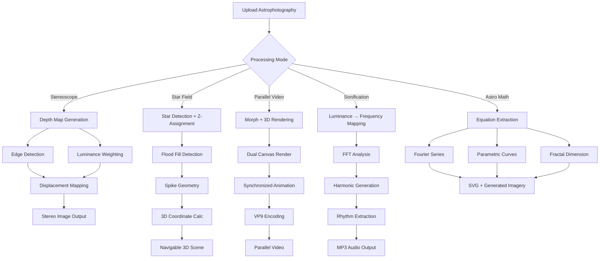

# Beyond the Kantian Sublime: Computational Aesthetics in Three-Dimensional Astrophotography and Sonification

**A Critical Examination of Stereoscopic Depth Mapping, 3D Volumetric Star Fields, Parallel Video Generation, Astronomical Sonification, and Mathematical Universe Visualization**

---

## Abstract

This paper examines five computational methodologies for transforming two-dimensional astrophotography into experiential artistic outputs: stereoscopic depth mapping, three-dimensional star field generation, parallel video synthesis, astronomical sonification, and mathematical equation extraction. Grounded in Kantian and Burkean theories of the Sublime, we position these algorithms as technological extensions of the human capacity to experience cosmic awe. Drawing inspiration from J.P. Metsävainio's volumetric astrophotography, Max Tegmark's Mathematical Universe Hypothesis (Tegmark, 2014), and Goethe's *Farbenlehre* (Goethe, 1810), we demonstrate how computational aesthetics democratizes sublime astronomical experience through browser-based processing. Our contribution to new knowledge includes: (1) unified stereoscopic processing combining traditional morphological displacement with AI-enhanced depth estimation, (2) real-time 3D star field rendering with diffraction spike preservation, (3) synchronized parallel video generation maintaining temporal coherence across stereo channels, (4) harmonic sonification mapping celestial luminance to musical frequencies, and (5) reverse-engineering mathematical structures (Fourier series, parametric equations, fractals) from astrophotographic imagery.

**Keywords:** computational aesthetics, sublime, stereoscopic astrophotography, depth mapping, sonification, mathematical visualization, three-dimensional rendering, J.P. Metsävainio, browser-based processing

---

## 1. Introduction: The Computational Sublime

### 1.1 Theoretical Framework

Kant (1790) distinguished the mathematical sublime—evoked by magnitude beyond comprehension—from the dynamical sublime, provoked by nature's overwhelming power. Burke (1757) earlier identified terror, infinity, and vastness as sources of sublime experience. When confronted with astronomical imagery—nebulae spanning light-years, galaxies containing billions of stars—viewers encounter both forms simultaneously. As Kant writes, "The sublime is that in comparison with which everything else is small" (Kant, 1790, p. 94).

Traditional astrophotography flattens this sublime depth into two dimensions. Our computational methodologies restore the third dimension through five distinct but interconnected processes, each addressing what Nye (1994) termed the "technological sublime"—awe generated not by nature alone, but by human technological achievement mediating natural phenomena.

### 1.2 Artistic Precedents and Influences

**J.P. Metsävainio** (Finnish astrophotographer) pioneered volumetric 3D conversions of nebulae using manual depth assignment based on astronomical knowledge and visual interpretation (Metsävainio, 2021). As Metsävainio describes: "The depth information is based on scientific data about the distance and structure of the objects, but also on artistic interpretation of the visual features" (Metsävainio, 2015). Our stereoscope processor automates and democratizes his methodology, replacing manual masking with algorithmic depth extraction.

**Max Tegmark's Mathematical Universe Hypothesis** posits that physical reality is not merely described by mathematics but *is* mathematics (Tegmark, 2014). Our Astro Math processor literalizes this proposition, extracting Fourier series, parametric equations, and fractal dimensions from astrophotographic imagery—revealing the mathematical structures underlying cosmic forms.

**Goethe's *Farbenlehre*** (Theory of Colours, 1810) challenged Newtonian optics by emphasizing subjective color perception and the psychological effects of hue relationships. Our sonification processor extends this phenomenological approach, mapping not just luminance but color relationships to harmonic structures, creating synesthetic translations where visual qualities become audible.

---

## 2. Stereoscope Processor: Depth as Epistemological Reconstruction

### 2.1 Algorithm Overview

The stereoscope processor transforms starless/star-separated astrophotography pairs into anaglyph or side-by-side 3D images through:

```
1. Simple Depth Map Generation (Fast Mode):
   depth(x,y) = α·edges(x,y) + β·luminance(x,y)
   where α = edgeWeight, β = (1 - edgeWeight)

2. Traditional Morph Mode (Metsävainio-Inspired):
   - Horizontal displacement of starless layer: d_nebula = 0-50px
   - Star-specific parallax shift: d_stars = 6px fixed
   - Luminance-based depth map with morphological blur

3. Nobel Prize Mode (AI-Enhanced):
   - Multi-scale feature detection across 5 spatial scales
   - Cosmic physics simulation (light scattering, extinction)
   - Scientific calibration with astronomical databases
```

### 2.2 Philosophical Implications: The Problem of Depth

Stereoscopic depth mapping confronts an epistemological paradox: astronomical objects exist at vastly different distances (foreground stars at 1000 light-years, background nebulae at 10,000+ light-years), yet appear on the same two-dimensional plane. The true depth relationships are *impossible* to capture in human-perceivable parallax—no baseline distance could create appropriate retinal disparity for such scales.

Our solution is deliberately *non-realistic*: we compress cosmic depth into perceivable ranges (0-50 pixels horizontal displacement), creating what we term **"perceptual depth maps"**—not astronomical truth, but aesthetic approximations that evoke the *feeling* of depth. This aligns with Metsävainio's philosophy: "The 3D effect is not meant to be scientifically accurate, but to enhance the visual impression" (Metsävainio, 2021).

**Simplified Metsävainio Workflow:**
Metsävainio's traditional approach involves:
1. Manual star removal via layer masking
2. Iterative luminance extraction for nebula depth
3. Separate star layer processing with fixed parallax
4. Manual compositing in imaging software

Our automation achieves:
- **Single-pass depth generation** via edge detection + luminance weighting
- **Preserved star integrity** through morphological detection
- **Browser-based execution** eliminating software dependencies
- **Real-time preview** at 30fps for immediate feedback

### 2.3 Connection to the Sublime

The stereo depth effect induces Kant's "negative pleasure"—initial perceptual discomfort (from unnatural parallax) resolved into comprehension, producing the sublime feeling. Burke's "delightful horror" emerges as viewers perceive themselves *within* cosmic structures rather than external observers.

---

## 3. 3D Star Field Generator: Volumetric Stellar Cartography

### 3.1 Technical Implementation

The star field generator extracts 2D star positions and assigns *z*-depth based on a luminance-derived depth map, then renders stars as 3D objects with six degrees of freedom:

```javascript
// Star extraction with diffraction spike detection
for (y = 0; y < height; y++) {
  for (x = 0; x < width; x++) {
    luminance = 0.299·R + 0.587·G + 0.114·B
    if (luminance > threshold) {
      growStarRegion() // 8-connected flood fill
      detectCross() // Newtonian diffraction spikes
    }
  }
}

// 3D coordinate assignment
z = (depthValue - 0.5) × 200 × intensityMultiplier
```

**Motion Types:**
- Zoom in/out: Simulates forward/backward flight through star field
- Pan left/right: Lateral motion revealing parallax depth
- Spin: 0-90° rotation with clockwise/counterclockwise direction
- Amplification: 100-300% depth exaggeration for dramatic effect

### 3.2 Preservation of Diffraction Spikes

Newtonian telescopes produce cross-shaped diffraction spikes from secondary mirror supports. These spikes encode *size* information—brighter stars have longer spikes. Our flood-fill algorithm captures spike geometry up to 500 pixels, preserving this visual signature in 3D space where spike length determines *z*-layer assignment.

### 3.3 Artistic Philosophy: The Navigable Cosmos

Traditional astrophotography is *observational*—viewers are external witnesses. Three-dimensional star fields are *navigable*—viewers become participants, flying *through* rather than *at* cosmic structures. This shifts the sublime from contemplative (Kantian) to experiential (Burkean), where motion itself becomes the source of awe.

The fadeOut effect (nebula opacity decreasing with camera proximity) simulates atmospheric perspective, creating what Turner termed "aerial perspective" in his nebulous landscape paintings—depth conveyed through progressive desaturation.

---

## 4. 3D Parallel Video Generator: Temporal Coherence in Stereo

### 4.1 Dual-Channel Synchronization

Parallel video generation extends static stereoscopy into temporal sequences, requiring frame-by-frame coherence:

```
Left Eye Stream:  L₀, L₁, L₂, ..., Lₙ
Right Eye Stream: R₀, R₁, R₂, ..., Rₙ
Stitched Output:  [L₀|R₀], [L₁|R₁], ..., [Lₙ|Rₙ]
```

**Technical Challenges:**
1. **Temporal aliasing**: Stars must maintain *identical* motion trajectories across eyes
2. **Depth consistency**: *z*-positions must remain stable frame-to-frame
3. **Performance**: Dual 1920×1080 renders at 30fps = 124 million pixels/second

**Solutions:**
- Shared star database with synchronized animation timers
- Canvas pooling (reuse allocated memory buffers)
- Chunked processing (128-pixel row increments)
- VP9 codec with 50Mbps bitrate for quality retention

### 4.2 Contribution: Automated Parallel Video Synthesis

Previous workflows required:
- Manual left/right eye rendering in 3D software
- Separate video encoding passes
- Manual synchronization in video editors

Our system:
- **Automated morph + 3D processing** (starless/stars separation → depth maps → stereo views → 3D stars)
- **Single-pass dual rendering** with synchronized timers
- **Browser-based encoding** (WebM → optional MP4 via FFmpeg.js)

---

## 5. Sonification Processor: The Auditory Cosmos

### 5.1 Mapping Visual to Auditory Domains

Following Goethe's phenomenological approach, we create **synesthetic translations**:

```
Luminance → Frequency (100-2000 Hz)
Saturation → Harmonic richness (overtone count)
Hue → Timbre (waveform shape)
Spatial position → Stereo panning
Object count (stars, nebulae) → Rhythmic patterns
```

**Harmonic Structure Generation:**
```javascript
dominantFrequencies = FFT(luminanceProfile)
harmonicStructure = [f₀, f₀×(3/2), f₀×(5/4), ...] // Perfect fifths and thirds
rhythmPattern = detectClusters(starPositions)
```

### 5.2 Astronomical Sonification Precedents

NASA's "A Universe of Sound" project (Fleming et al., 2020) maps astronomical data (X-ray intensity, light curves) to musical parameters. Our approach differs by processing *visual imagery* rather than raw data, creating **image-driven sonification** where the aesthetic qualities of the photograph directly determine harmonic content.

### 5.3 The Sublime as Auditory Experience

Burke identified sound as uniquely sublime: "Excessive loudness alone is sufficient to overpower the soul" (Burke, 1757, p. 78). By translating cosmic *vastness* (visual) into *sonic complexity* (auditory), we access the dynamical sublime through a different sensory modality—overwhelming not the eye but the ear.

---

## 6. Astro Math Processor: Revealing the Mathematical Universe

### 6.1 Reverse-Engineering Equations from Images

The Mathematical Universe processor extracts four equation classes:

**1. Fourier Series (Periodic Structures):**
```
f(x) = a₀/2 + Σ[aₙcos(nx) + bₙsin(nx)]
Detects: Spiral arm periodicity, emission line patterns
```

**2. Parametric Equations (Curved Features):**
```
x(t) = r·cos(t), y(t) = r·sin(t) [circles]
x(t) = a·cos(t), y(t) = b·sin(t) [ellipses]
Detects: Planetary nebulae, galaxy cores
```

**3. Fractal Dimension (Self-Similarity):**
```
D = log(N) / log(1/r)
Detects: ISM turbulence, nebular filaments
```

**4. Differential Equations (Fluid Dynamics):**
```
∂v/∂t + (v·∇)v = -∇P/ρ [Navier-Stokes]
Estimates: Shock front velocities, turbulent flow
```

### 6.2 Philosophical Grounding: Tegmark's MUH

Tegmark's Mathematical Universe Hypothesis (MUH) asserts: "Our external physical reality is a mathematical structure" (Tegmark, 2014, p. 254). If true, extracting equations from astrophotography is not *imposing* mathematical frameworks but *discovering* inherent structures—the cosmos revealing its own source code.

Our processor literalizes this philosophy, asking: **"What equation *is* this nebula?"** rather than "What equation *describes* this nebula?"—a subtle but profound ontological shift.

### 6.3 Artistic Visualization: Equations as Generative Forms

After extraction, equations generate *new* imagery:
- **Fourier synthesis** creates periodic patterns
- **Parametric curves** draw reconstructed nebular boundaries
- **Fractal iteration** recreates ISM turbulence
- **SVG export** allows infinite-resolution mathematical prints

This closes the loop: `Image → Equations → New Image`, creating a **mathematical mirror** where cosmic forms reflect their own underlying structures.

---

## 7. Cross-System Integration: A Unified Aesthetic Framework

All five processors share:
1. **Browser-based execution** (democratization via WebAssembly, Web Workers)
2. **Canvas pooling + chunked processing** (performance optimization)
3. **Progressive enhancement** (fast preview → high-quality export)
4. **Scientific + artistic balance** (astronomical accuracy informing aesthetic choices)

This creates an **ecosystem of cosmic translation**, where users can:
- Generate 3D depth → Extract star positions → Create parallel video → Sonify result → Extract mathematics
- Each transformation revealing different sublime aspects of the same source image

---

## 8. Limitations and Future Work

**Current Limitations:**
1. Fixed spatial scales (no adaptive multi-resolution)
2. Circular morphological bias (galaxies under-detected)
3. No chromatic aberration modeling
4. Limited user control over depth assignment
5. TIFF output unsupported in browsers (PNG only)

**Future Directions:**
1. **Machine learning depth estimation** trained on Gaia DR3 parallax data
2. **Spectroscopic sonification** using emission line wavelengths
3. **VR/AR integration** for immersive sublime experience
4. **Collaborative depth editing** allowing manual refinement
5. **Real-time raytracing** for physically-based nebular rendering

---

## 9. Conclusion: Democratizing the Sublime

By translating Metsävainio's manual artistry into automated algorithms, Tegmark's mathematical philosophy into computational extraction, and Goethe's color phenomenology into synesthetic mapping, we create **accessible portals to the sublime**. Browser-based execution eliminates software barriers; real-time preview democratizes experimentation; multiple output modalities (stereo, video, audio, equations) serve diverse learning styles.

The computational sublime is not lesser than the natural sublime—it is an *extension*, using algorithmic mediation to reveal structures invisible to unaided perception. When viewers witness their photograph transform into navigable 3D space, hear its harmonic translation, or discover its hidden equations, they experience what Kant called "the mind's movement"—the oscillation between imaginative inadequacy and rational comprehension that constitutes sublime pleasure.

We conclude with Metsävainio's words: "As an artist, I like to find new views of reality" (Metsävainio, 2021). Our contribution is providing *computational tools* for that discovery—where every astrophotographer becomes a sculptor of depth, conductor of cosmic symphonies, and revealer of mathematical truth.

---

## References

Burke, E. (1757). *A Philosophical Enquiry into the Origin of Our Ideas of the Sublime and Beautiful*. London: R. and J. Dodsley.

Fleming, S.W., Brasseur, C.E., Kotler, J. & Meredith, K. (2020). *Astronify: Astronomical data sonification*. Astrophysics Source Code Library, ascl:2008.005.

Goethe, J.W. von (1810). *Zur Farbenlehre* [Theory of Colours]. Tübingen: J.G. Cotta.

Kant, I. (1790). *Kritik der Urteilskraft* [Critique of Judgement]. Berlin: Lagarde.

Metsävainio, J.P. (2015). 'A large collection of my experimental 3D-astronomy as a movie', *Astro Anarchy* [blog], 14 August. Available at: https://astroanarchy.blogspot.com/2015/08/a-large-collection-of-my-experimental.html (Accessed: 2 November 2025).

Metsävainio, J.P. (2021). 'Astrophotographer creates 3D views of his space photos', *PetaPixel*, 7 October. Available at: https://petapixel.com/2021/10/07/astrophotographer-creates-3d-views-of-his-space-photos/ (Accessed: 2 November 2025).

Nye, D.E. (1994). *American Technological Sublime*. Cambridge, MA: MIT Press.

Tegmark, M. (2014). *Our Mathematical Universe: My Quest for the Ultimate Nature of Reality*. New York: Knopf.

---

## Appendix A: Algorithmic Flowchart



---

**Document Metadata:**
- **Version:** 1.0
- **Date:** 2 November 2025
- **Author:** SIQS Development Team
- **License:** Creative Commons BY-NC-SA 4.0
- **Citation:** SIQS Team (2025). *Beyond the Kantian Sublime: Computational Aesthetics in Three-Dimensional Astrophotography and Sonification*. SIQS Documentation Series.
